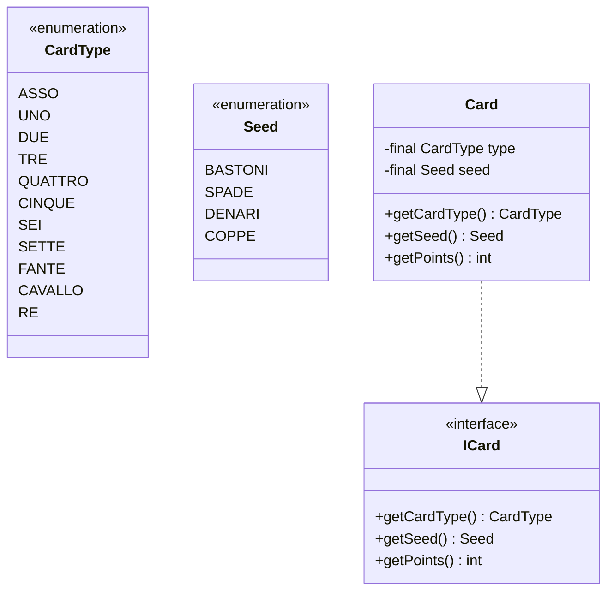

```mermaid
classDiagram
class CardType {
    <<enumeration>>
    ASSO
    UNO
    DUE
    TRE
    QUATTRO
    CINQUE
    SEI
    SETTE
    FANTE
    CAVALLO
    RE
}
class Seed {
    <<enumeration>>
    BASTONI
    SPADE
    DENARI
    COPPE
}
class ICard {
  <<interface>>
  +getCardType() CardType
  +getSeed() Seed
  +getPoints() int
}

class Card {
    -final CardType type
    -final Seed seed

    +getCardType() CardType
    +getSeed() Seed
    +getPoints() int
}

Card ..|> ICard
```
