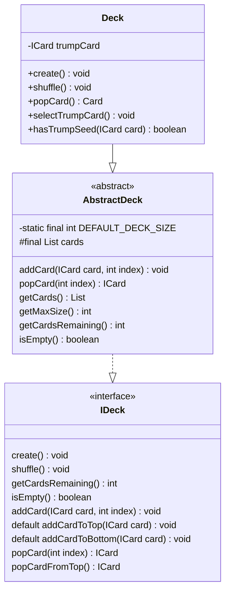

```mermaid
classDiagram
class IDeck {
    <<interface>>

    create() void
    shuffle() void
    getCardsRemaining() int
    isEmpty() boolean
    addCard(ICard card, int index) void
    default addCardToTop(ICard card) void
    default addCardToBottom(ICard card) void
    popCard(int index) ICard
    popCardFromTop() ICard
}

class AbstractDeck {
    <<abstract>>
    -static final int DEFAULT_DECK_SIZE
    #final List<ICard> cards

    addCard(ICard card, int index) void
    popCard(int index) ICard
    getCards() List<ICard>
    getMaxSize() int
    getCardsRemaining() int
    isEmpty() boolean
}
AbstractDeck ..|> IDeck

class Deck {
    -ICard trumpCard

    +create() void
    +shuffle() void
    +popCard() Card
    +selectTrumpCard() void
    +hasTrumpSeed(ICard card) boolean
}
Deck --|> AbstractDeck
```
