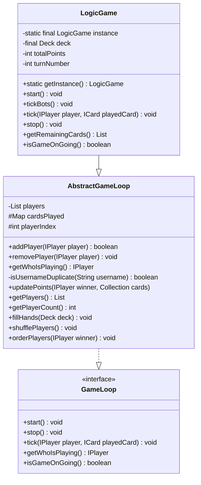

```mermaid
classDiagram
class GameLoop {
    <<interface>>

    +start() void
    +stop() void
    +tick(IPlayer player, ICard playedCard) void
    +getWhoIsPlaying() IPlayer
    +isGameOnGoing() boolean
}

class AbstractGameLoop {
    -List<IPlayer> players
    #Map<String, ICard> cardsPlayed
    #int playerIndex

    +addPlayer(IPlayer player) boolean
    +removePlayer(IPlayer player) void
    +getWhoIsPlaying() IPlayer
    -isUsernameDuplicate(String username) boolean
    +updatePoints(IPlayer winner, Collection<ICard> cards)
    +getPlayers() List<IPlayer> 
    +getPlayerCount() int
    +fillHands(Deck deck) void
    +shufflePlayers() void
    +orderPlayers(IPlayer winner) void
}
AbstractGameLoop ..|> GameLoop

class LogicGame {
    -static final LogicGame instance
    -final Deck deck
    -int totalPoints
    -int turnNumber

    +static getInstance() LogicGame
    +start() void
    +tickBots() void
    +tick(IPlayer player, ICard playedCard) void
    +stop() void
    +getRemainingCards() List<ICard>
    +isGameOnGoing() boolean
}
LogicGame --|>AbstractGameLoop
```
