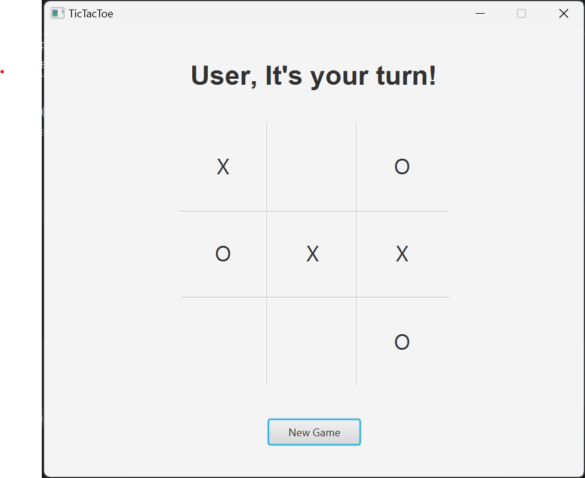

# TicTacToe with MINIMAX AI

## How to play TicTacToe?
TicTacToe is a simple game, in which two player takes turn in marking empty spaces in a 3x3 grid,
with X's or O's symbols. The player who succeeds in placing three of his marking symbol adjacent in a horizontal,
vertical, or diagonal row win. If the game reaches a final state in which all the grid is full but nobody win,
then it is a tie.
Note that in this case, one of the player(X-player) is a user which pick every turn his choice, while the other player
(O-player) will be managed by an internal AI that uses the minimax algorithm...(see more later).

## Let's look at the implementation:
The game is basically composed of a main Class (App.java), only used to set the Scene with an FXMLLoader
containing the FXML file(board-view.fxml) obtained by creating my scene in SceneBuilder.
Then the game has 3 other different Classes:
- Controller: 
    - BoardController.java 
- Model:
    - State.java
    - Game.java

we'll analyse them in detail later.

### Controller: BoardController.java
In the controller class we have as attributes the FXML components of the scene, in fact we use controller
to change the GUI while the game is involving. 
This class uses also a collection, particularly an Arraylist<Stackpane>, that contains ALL
the panes associated with the 9 tiles in the scene.
The association between the FXML components (stackpanes containing labels) and the Arraylist is done
in the initialize() method, automatically called when the FXML file is loaded.
Note that BoardController.java implements Inizialible!!

.png)

The controller implements all the functions necessary to regulate evolution in the game, 
for example allows you to start games with the @FXML handleNewGame() method, which is called by clicking the
'new game' button in the scene.
It also constructs the user player turn, by associating each pane of the Arraylist an 'onMouseClickedEvent', so that every time
the user click a button (choosing its move when it's his turn) the controller fills the pane with his symbol, and then,
since the user has finished his turn, check for possible victory and if not implement the Artificial Intelligence turn,
by calling with the Game instance the miniMaxDecision() method, that will be explained later.
The BoardController contains many other methods like getBoardState(), that return a State object representing the current
state of the board, or like the methods that manages the heading label and the labels in the panes, or the methods
necessary for the game, such as checkWin() and checkValidMove()...
It is very important for the application because literally manage every aspect of the GUI

Example of a user-turn managed by the controller class

## minimax Algorithm Implementation with Model classes
The minimax Algorithm is a kind of backtracking algorithm used in game theory to find the best optimal move
for a player, assuming that also the opponent plays optimally.
In minimax the two player are called maximizer and minimizer, so the maximizer has the scope to
get the highest score possible from a move, and the minimizer has the scope to get the lowest
possible score from a move.
In order to do this, every state of the board is associated with a value. Basically, in a given state
if the maximizer player is ahead, then the state will give a positive value, and on the other hand, if the 
minimizer player is ahead, then the given state will give a negative value.
Note that this is a backtracking algorithm, so it check all the possible moves for a given state, and
choose the best (the highest for maximizer player, and the lowest for the minimizer). So, it is possible to implement
minimax on TicTacToe, because the possible states are quite narrow, but for example in Chess game minimax CANNOT be
used because computing the best move would take too much time!
Now that we know the theory, let's look at the implementation in java for ticTacToe...

### PRELIMINARY: IN OUR GAME O-PLAYER IS MAXIMIZER, AND X-PLAYER IS MINIMIZER!

## State.java
This class represents the states of the game's board, by using a String array(String[] state).
Basically the i-element of the array contains a string representing the value of the i-pane in the board,
so the possible state for the i-element in the array is:
- X, if the i-pane in the board is chosen by X-player(user)
- O, if the i-pane in the board is chosen by O-player(AI)
- "", if anyone has chosen the i-pane yet

When a State instance is created, it requires the position of the new move, and the State, as a string Array,
in which the move leads to.
Then this class has the getter and setter methods for its fields (int position, String[] state), and
a specific method getStateIndex(), that passed an index of the board, will return the state of the
i-pane in the state array.

The Game.java class will use the State.java class to save every state after a move in order to
check move by move how the game is going on.

Example of a State object printed:
State{position=0, state=[X,1,2,3,4,5,6,7,8]}

## Game.java
This class implements all the methods useful for calculating the best move for the players,
from a given state of the board.
In our game, this algorithm is used only by the O-player, but he assumes that also the user ALWAYS
peeks the best move for the win. Clearly, the adversary is human, so he can commit errors and the AI
will take the opportunity to make the best move to win.
In the boardController.java when its AI turn, it is called with an instance of this class the 
minMaxDecision() method, with passing the current state of the board, then this method:
- obtain, from calling the successorsOf(State) method, an Arraylist with the possible
states associated with the possible moves from the given state.
- obtain, from calling for each possible move minValue(state), the value that leads to for choosing that move.

At the end of the process, we have an arrayList with the possible moves associated with their states, and
an arrayList with the values associated with the possible moves, so it remains to chose the move associated
with the max value, because the O-player is the maximizer, and return the move to the controller that will
insert in the board!!

Note that for this process, many methods in background are called, for example isTerminalState, that
check if the current state is terminal, and the also UtilityOf, that return the value of a terminal state,
by checking if max player win(1), or min player win(-1), or it is a tie(0).

Note also that the function MinValue(state) and MaxValue(state), correspond to calculate the best move
for the minimizer and maximizer player respectively, and they call each other until the state passed 
to one of them is terminal, so the recursion terminate and return the best move for the player that call
first his respective function because it was his turn.
In our game will be always the o-player calling as first, but then will be called also the function
for the minimizer player because, as we say earlier, the max player calculate the best move by assuming
also the min player will peek the best move for himself!!